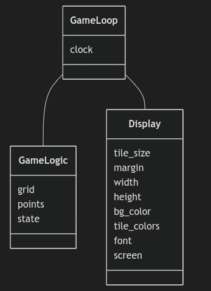
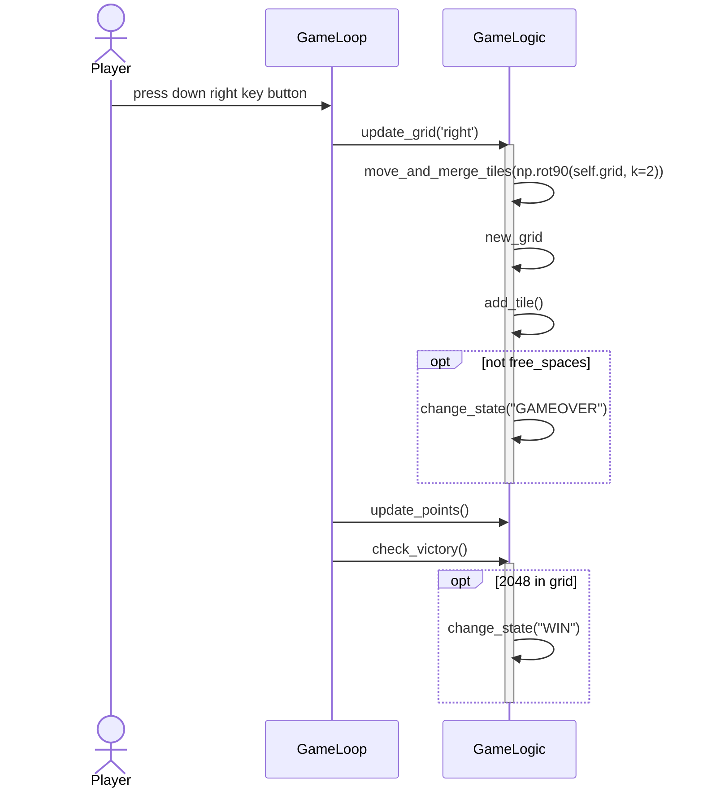

# Arkkitehtuurikuvaus

## Rakenne

Entities-kansio sisältää User-luokan, joka vastaa käyttäjän tietojen säilytämisestä ohjelman suorituksen aikana. Repositories-kansio sisältää UserRepository-luokan, joka vastaa käyttäjän tietojen hakemisesta ja talletamisesta SQLite-tietokantaan. Luokka display vastaa peliruudun piirtämisestä, GameLogic pelin sisäisen logiikan päivittämiseestä ja GameLoop peliloopin ja käyttäjän syötteiden käsittelystä.

## Luokkakaavio

Sovelluksen luokkarakenne selviää seuraavasta kuvaajasta. Riippuvuudet GameLogic ja Display injektoidaan uokalle GameLoop. Luokilla GameLogic ja UserRepository on riippuvuus luokkaan User.

## Käyttöliittymä

Pelin käyttöliittymä sisältää peliruudukon sekä pelaajan pisteet ja ennätyspistemäärän.

## Pelin tilan päivittyminen

Kun pelaaja painaa jotain nuolinäppäimistä liikuttaakseen pelilaattoja, toimii sovelluslogiikka seuraavalla tavalla:

## Tietojen pysyväistallennus

Luokka UserRepository vastaa pelaajan tietojen tallettamisesta SQLite-tietokantaan. Tietokannassa on yksi tietokantataulu, users, joka sisältää pelaajan käyttäjänimen ja ennätyspistemäärän.
