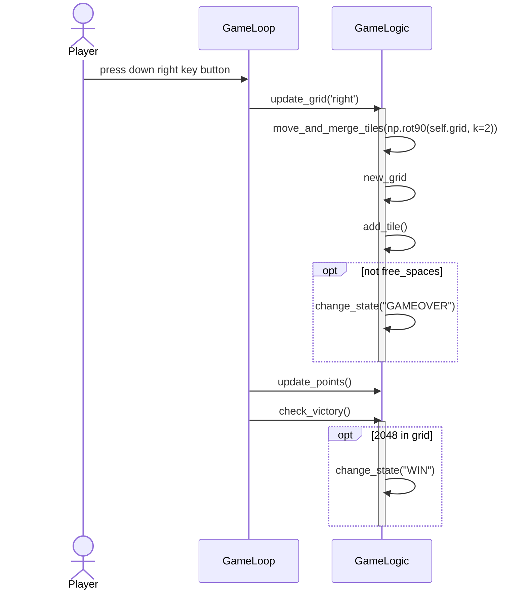

## Luokkakaavio

## Pelin tilan päivittyminen

Kun pelaaja painaa jotain nuolinäppäimistä liikuttaakseen pelilaattoja, toimii sovelluslogiikka seuraavalla tavalla:

```mermaid
sequenceDiagram
    actor Player
    participant GameLoop
    participant GameLogic
    Player->>GameLoop: press down right key button
    GameLoop->>GameLogic: update_grid('right')
    activate GameLogic
    GameLogic->>GameLogic: move_and_merge_tiles(np.rot90(self.grid, k=2))
    GameLogic->>GameLogic: new_grid
    GameLogic->>GameLogic: add_tile()
    opt not free_spaces
    GameLogic->>GameLogic: change_state("GAMEOVER")
    end
    deactivate GameLogic
    GameLoop->>GameLogic: update_points()
    GameLoop->>GameLogic: check_victory()
    activate GameLogic
    opt 2048 in grid
    GameLogic->>GameLogic: change_state("WIN")
    end
    deactivate GameLogic

```
