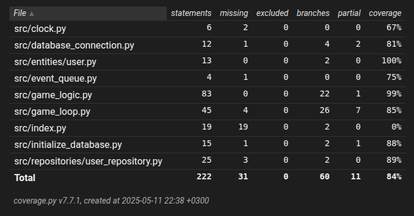

# Testausdokumentti

Sovellusta testataan yksikkötesteillä sekä integraatiotesteillä, joita kohdistetaan GameLogic- ja GameLoop-luokkiin. Testikansiossa on määritelty conftest.py -tiedosto, joka alustaa testitietokannan.

## Sovelluslogiikka

Sovelluslogiikasta vastaa GameLogic-luokka, jolle tehdään automatisoituja ykikkötestejä TestGameLogic-luokalla. Kun GameLogic-luokka alustetaan, sille injektoidaan riippuvuutena Userrepository-luokka, jolle määritellään yhteys testitietokantaan. Testien setupissa määritellään myös random seed, jotta pelin satunnaisuus ei vaikuttaisi testaamiseen.

## Pelilooppi

Peliloopin toiminnasta vastaa GameLoop-luokka, jolle tehdään automatisoituja testejä TestGameLoop-luokalla. Testejä varten määritellään MockClock-, MockEvent- ja MockEventQueue-luokat sekä mock_display-olio, jotka injektoidaan GameLoop-oliolle riippuvuuksina. Nämä testit ovat myös integraatiotestejä, sillä GameLoop-oliolle injektoidaan riippuvuutena GameLogic-luokan olio.

## Testauskattavuus

Sovelluksen estauksen haarautumakattavuus on 84%. Käyttöliittymän testaus on jätetty haarautumakattavuuden ulkopuolelle.

## Järjestelmätestaus

Järsjestelmätestaus on suoritettu manuaalisesti linux-käyttöjärjestelmällä. Sovelluksen asennus ja konfiguraatio toimii käyttöohjeiden mukaisesti. Sovellus täyttää vaatimusmäärittelydokumentin sisältämät vaatimukset.
