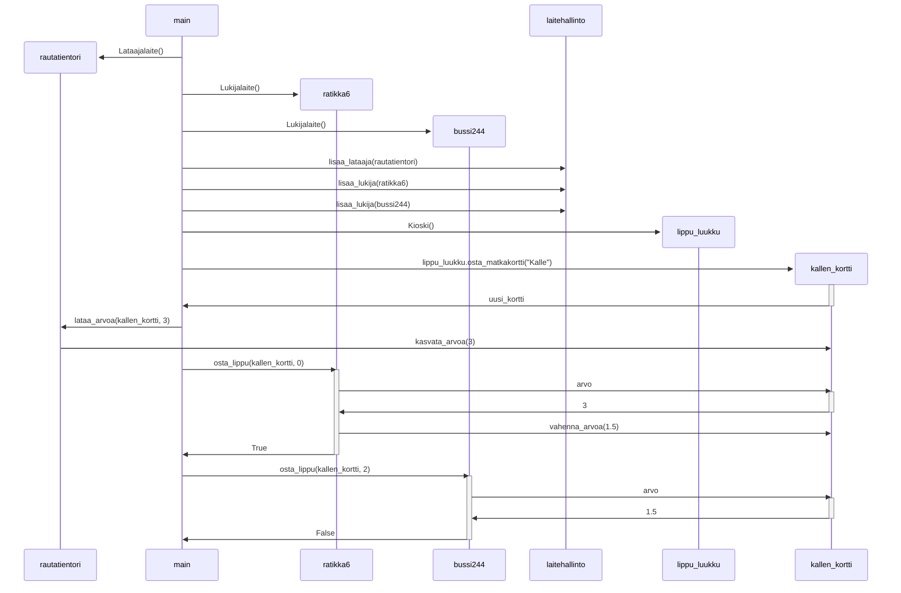

```mermaid
sequenceDiagram
create participant rautatientori
main->>rautatientori: Lataajalaite()
create participant ratikka6
main->>ratikka6: Lukijalaite()
create participant bussi244
main->>bussi244: Lukijalaite()
main->>laitehallinto: lisaa_lataaja(rautatientori)
main->>laitehallinto: lisaa_lukija(ratikka6)
main->>laitehallinto: lisaa_lukija(bussi244)
create participant lippu_luukku
main->>lippu_luukku: Kioski()
create participant kallen_kortti
main->>kallen_kortti: lippu_luukku.osta_matkakortti("Kalle")
activate kallen_kortti
kallen_kortti->>main: uusi_kortti
deactivate kallen_kortti
main->>rautatientori: lataa_arvoa(kallen_kortti, 3)
rautatientori->> kallen_kortti: kasvata_arvoa(3)
main->>ratikka6: osta_lippu(kallen_kortti, 0)
activate ratikka6
ratikka6->>kallen_kortti: arvo
activate kallen_kortti
kallen_kortti->>ratikka6: 3
deactivate kallen_kortti
ratikka6->>kallen_kortti: vahenna_arvoa(1.5)
ratikka6->>main: True
deactivate ratikka6
main->>bussi244: osta_lippu(kallen_kortti, 2)
activate bussi244
bussi244->>kallen_kortti: arvo
activate kallen_kortti
kallen_kortti->>bussi244: 1.5
deactivate kallen_kortti
bussi244->>main: False
deactivate bussi244

```
